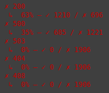
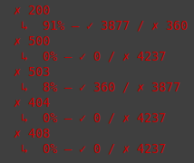
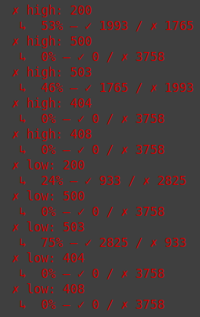
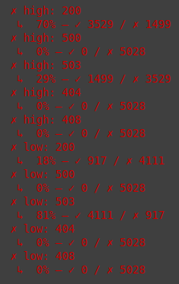

# aspnet_load_shedding

### Farfetch.LoadShedding:

- Repo: https://github.com/Farfetch/loadshedding.
- Docs: https://farfetch.github.io/loadshedding/docs.
- Packages: https://farfetch.github.io/loadshedding/docs/getting-started/packages.

### Interesting references:

- [Keeping Netflix Reliable Using Prioritized Load Shedding](https://netflixtechblog.com/keeping-netflix-reliable-using-prioritized-load-shedding-6cc827b02f94) by Netflix TechBlog
- [Performance Under Load](https://netflixtechblog.medium.com/performance-under-load-3e6fa9a60581) by Netflix TechBlog

### Useful materials:

- [The NETFLIX Way to Keep Your .NET APIs Reliable](https://www.youtube.com/watch?v=paYrVKO1Pi4&t=622s) by [Gui Ferreira](https://guiferreira.me/).
- [Rate Limiting vs Load Shedding](https://www.youtube.com/watch?v=JAWgpC-NaW8) by Tech Primers.

### Run locally

To imitate a scenario when the web API is running low on free resources to the point of an overload I decided to run it in a low-spec Docker container.

Build Docker image:

```shell
docker build -t load-shedding -f Dockerfile .
```

Run container with limited resources (1 CPU, 256 MB RAM):

```shell
docker run --name load-shedding-container -p 5000:8080 --cpus=1 --memory=256m load-shedding:latest
```

### Testing under load

[k6](https://k6.io/docs/) scripts [here](/scripts/).

Run test scripts (Debian/Ubuntu, native k6 install):

```shell
k6 run limiter_default.js
```

### Test results:

#### Initial web API app, no load shedding:



35% of requests failed with `500` (`OutOfMemory` exception).

#### Limiter middleware, default:



Simply adding the default load shedding increased the amount of `200` responses by around 30%. No requests ended in `500`, but were handled gracefully instead with `503`s.

#### Limiter middleware, no priority:



- `MediaController`: `200` - 53%, `503` - 46%.
- `UserPreferencesController`: `200` - 24%, `503` - 75%.

#### Limiter middleware, priority defined:



- `MediaController` (Critical (high) priority): `200` - 70%, `503` - 29%.
- `UserPreferencesController` (NonCritical (low) priority): `200` - 18%, `503` - 81%.

`MediaController` is visibly prioritized (29% vs 81% rejected).
